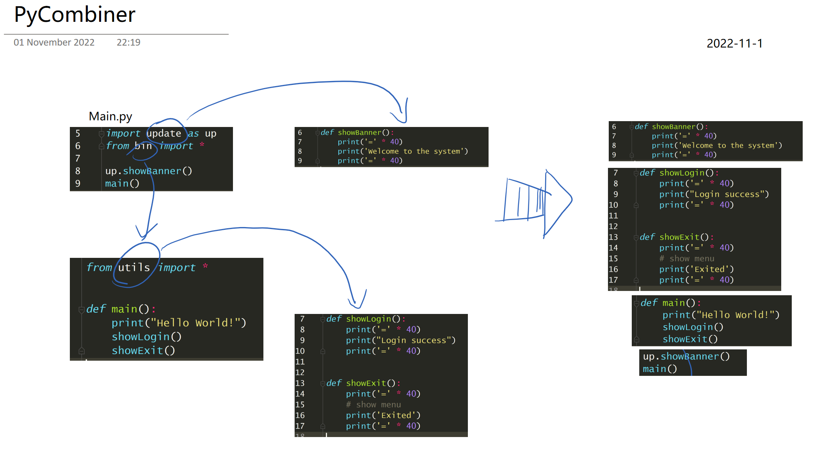

The logic of PyCombiner
=======================

parser files to get 3 Parts of each .py file
~~~~~~~~~~~~~~~~~~~~~~~~~~~~~~~~~~~~~~~~~~~~

-  import ... sentence
-  from ... import sentence
-  Remaining lines of code to be imported.

|image0|

How it deals with import
~~~~~~~~~~~~~~~~~~~~~~~~

statements summarize introduce of it simply, It is render "import ..."
to ["import ... ", "codeLines"] There are some instances:

.. code:: python

    # 1. local module totally
    # TODO: dont know that How process it
    import utils
    res1 = []

    # 2. lib module
    # just keep the import statement
    import os
    res2 = [['import os'], []]

    # 3.  local module totally import
    from service import *  #
    res3 = [[], ['def ...', '...', 'def ...', '...']]

    # 4.1 local module partially import
    # TODO: cant process it
    from echo import showWelcome
    res4 = [[], ['def showWelcome():', '...']]
    # 4.2 partially import but use other function
    from src import showRests

TODO
====

-  Can't process the "as ..." statements

.. code:: python

   from src import showString as s

